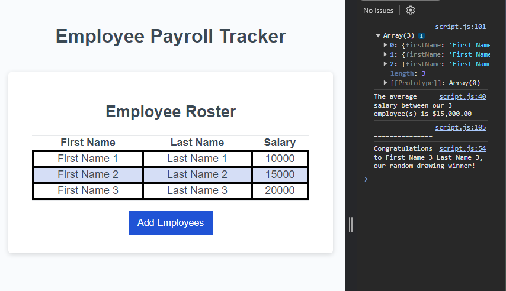

# Payroll-Track

## This week, I applied my new skills to create an Employee Payroll Tracker. This application is designed to help users efficiently manage and track employee payroll details through an interactive interface.

- By clicking the "Add Employees" button users can input employee information through a series of prompts. The prompts collect data like the employees first name, last name and salary.

- Users have the ability to add as many employees as they need or cancel the input process at any point.

- Once the user has finished entering the data, the application displays the list of employees on the page, sorted alphabetically by last name. This makes it easier to find specific entries and manage the list.

- The console displays aggregated data such as the average employee salary offering a quick snapshot into the organizations payroll cost.

## Usage

## Collaborators

This project was made possible with the help of:

[Jordan Gonzales](https://github.com/JordanGWiz)

[Adam Rosenberg](https://github.com/AcoderRose)
